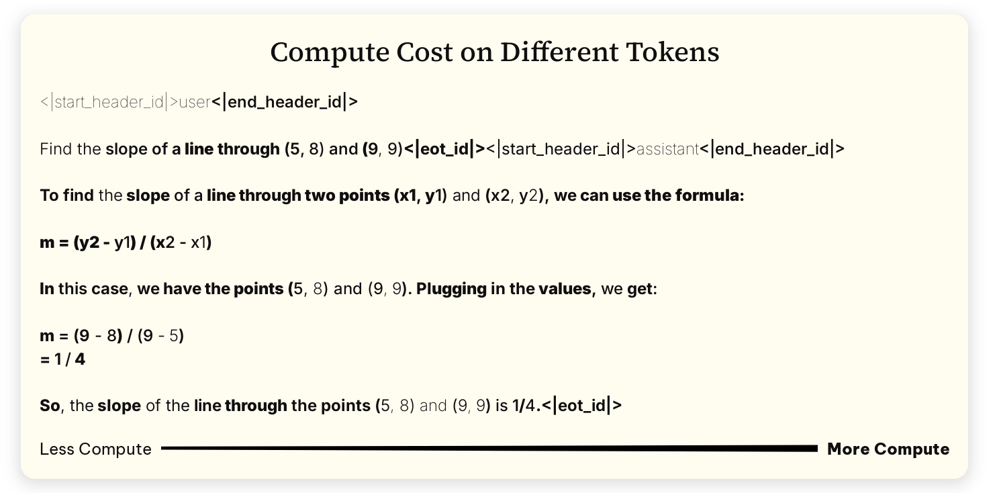

<div align="center">
    <h1>
    Compute Where It Counts: High Quality Sparsely Activated LLMs
    </h1>
</div>

<div align="center">
    <h4>
        <a href="https://crystalai.org/blog/2025-08-18-compute-where-it-counts" target='_blank'>
        
        </a>
        <a href="https://crystalai.org/papers/compute-where-it-counts.pdf" target='_blank'>
        
        </a>
        
    </h4>
    <div >
        <a>Cyris Kissane</a><sup>1*</sup>&emsp;
        <a>Adam Klein</a><sup>1*</sup>&emsp;
        <a>Niveditha Iyer</a><sup>1*</sup>&emsp;
    </div>
    <div>
        Crystal Computing Corp.<sup>1</sup>
        <br>
        <sup>*</sup>equal contribution
    </div>
</div>

<br>

<div align="center">
    <p>
        <span style="font-variant: small-caps;"><strong>CWIC</strong></span> is a new method for creating efficient transformers that automatically decide when to use more or less compute.
        <br>
        <i>⭐ CWIC makes models <b>faster</b>, more <b>efficient</b>, and more <b>interpretable</b>!</i>
    </p>
    
    <p>:open_book: See more visual results on our <a href="https://crystalai.org/blog/2025-08-18-compute-where-it-counts" target="_blank">project page</a></p>
</div>

<br>

<details open>
<summary><b>Stats</b></summary>
    <br>
    <div align="center">
        <p align="justify">
            
1. CWIC yields a 3x increase in CPU throughput with only a 10% reduction in benchmark performance.

2. CWIC uses a different amount of compute for each token, making task difficulty interpretable.

3. CWIC directly optimizes compute as a loss function, and learns to budget compute without labelled data or hand-crafted heuristics.

4. The CWIC architecture uses learned activation thresholds and expressive sparsity patterns to enable adaptive computation.
        </p>
    </div>
</details>

Read more [on our blog](https://crystalai.org/blog/2025-08-18-compute-where-it-counts)!


## :fire: News

- [Aug 25, 2025] torch training code is ready!
- [Aug 22, 2025] torch inference code and huggingface weights are released!
- [Aug 18, 2025] blog & jax training code is released!


## 🔧 Installation

1. Clone Repo
    ```bash
    git clone https://github.com/crystal-ai-org/cwic
    cd cwic
    ```

2. Install Pixi to manage the python environment
    ```bash
    curl -fsSL https://pixi.sh/install.sh | sh
    source ~/.bashrc # make sure pixi in path
    ```
3. Install Python Dependencies
    
    ```
    pixi shell
    ```
<!-- 
 -->

## Usage

### Inference
```bash
python cwic/chat_with_it.py
```
This will let you chat with one of our [**Pretrained Models**](#pretrained-models) models and get output highlighted based off active parameters used!
Note: this might take a few minutes the first time you run it as it will download HuggingFace checkpoints.

The model output is highlighted to indicate the amount of compute spent on each. Darker blue indicates more compute, lighter yellow indicates less compute. Here is an example from a run where we requested Python code for the Fibonacci Series:

(If on MacOS, it's recommended to run this script in a code editor terminal, ghostty or iTerm. Running it in default Terminal.app doesn't seem to display the highlights.)

### Training
<!-- ## Training in torch is currently broken, you can run the JAX based training though and then convert the checkpoints -->
```sh
wandb login
# gcloud auth application-default login --no-launch-browser # for saving checkpoints to google cloud
# CWIC train a huggingface model directly
python cwic/train.py
# or
# train using the original jax code for the paper
# python cwic/cwic_scripts/train_cwic.py
```
# Pretrained Models

Pretrained models are uploaded to [Hugging Face](https://huggingface.co/crystal-ai):  finetuned on upto 1.3B tokens on [crystal-ai/chat-compilation-benchmark-5x-Llama-3.2-Instruct-Shuffled](https://huggingface.co/datasets/crystal-ai/chat-compilation-benchmark-5x-Llama-3.2-Instruct-Shuffled)

The models will be autodownloaded by the generation script below.

```sh
python cwic/chat_with_it.py
```

| Model | Parameters| Avg. Active Parameters| Avg. Reduction | Tokens |
| ------------|---|-----------|--- | --|
| [crystal-ai/CWICLlama-3.2-1B-A620M-Instruct](https://huggingface.co/crystal-ai/CWICLlama-3.2-1B-A620M-Instruct) | 1.2B | 620M 	| 2x | 0.26B|
| [crystal-ai/CWICLlama-3.2-1B-A413M-Instruct](https://huggingface.co/crystal-ai/CWICLlama-3.2-1B-A413M-Instruct) | 1.2B | 413M |3x| 0.52B|
| [crystal-ai/CWICLlama-3.2-1B-A310M-Instruct](https://huggingface.co/crystal-ai/CWICLlama-3.2-1B-A310M-Instruct) | 1.2B | 310M |4x| 0.78B|
| [crystal-ai/CWICLlama-3.2-1B-A248M-Instruct](https://huggingface.co/crystal-ai/CWICLlama-3.2-1B-A248M-Instruct) | 1.2B | 248M |5x| 1.04B|
| [crystal-ai/CWICLlama-3.2-1B-A206M-Instruct](https://huggingface.co/crystal-ai/CWICLlama-3.2-1B-A206M-Instruct) | 1.2B | 206M |6x| 1.30B|

Note: these are base models trained for only  1.3B tokens, without any form of downstream modification (instruction tuning, etc.). Performance is expected to be comparable or better than other sparsity methods trained on similar data, but might not beat dedicated small models such as SmolLM trained on *trillions* of tokens in all cases.

## Background
Large language models have become ubiquitous tools for natural language tasks. However, LLM inference requirements have grown beyond consumer devices and drive massive industry hardware expenses. For many applications, especially agentic ones, inference speed and cost are critical bottlenecks for real world deployment.

Therefore, many methods have been proposed to improve LLM inference efficiency. These include [quantization](https://arxiv.org/abs/2402.16775), [pruning](https://arxiv.org/abs/2305.11627), and [sparse Mixture of Experts (MoE)](https://arxiv.org/abs/1701.06538). Activation sparsity, the category in which CWIC falls, is another such approach. It focuses on removing small and inconsequential activations from the inputs of matrix multiplications, allowing some computations to be skipped without affecting the model's output.

One of the earliest activation sparsity methods for LLMs was [Relufication](https://arxiv.org/abs/2310.04564), which inserted ReLU activation functions into LLMs to induce sparsity. [ProSparse](https://arxiv.org/abs/2402.13516v4) further increased sparsity by adding an L1 penalty to the ReLU activations. [Deja Vu](https://arxiv.org/abs/2310.17157) and [ShadowLLM](https://arxiv.org/abs/2406.16635) predicted sparsity on the fly by training small auxiliary MLPs. [Q-Sparse](https://arxiv.org/abs/2407.10969) discarded all but the top-K largest activations, and demonstrated a *sparse scaling law* where larger models are more robust to sparsity.

Most similar to our work are [CATS](https://arxiv.org/abs/2404.08763), [TEAL](https://www.together.ai/blog/teal-training-free-activation-sparsity-in-large-language-models), and [R-SPARSE](https://arxiv.org/abs/2504.19449). These methods all remove activations with smaller magnitude than a *threshold*. However, none of these methods directly learn activation thresholds. Furthermore, these methods suffer from performance collapse at high sparsity levels. CWIC addresses both limitations.

## Motivating Insights

1. Learned parameters perform better than heuristically chosen ones. The often-quoted ["bitter lesson"](http://www.incompleteideas.net/IncIdeas/BitterLesson.html) states that general learning methods have historically outperformed hand-crafted approaches. We noticed that previous activation sparsity methods like [TEAL](https://www.together.ai/blog/teal-training-free-activation-sparsity-in-large-language-models) (block-wise greedy optimization) and [R-Sparse](https://arxiv.org/abs/2504.19449) (search algorithm) used heuristics to determine activation thresholds. We hypothesized that learning thresholds directly through backpropagation would lead to better results.

2. Adaptive computation methods with higher combinatorial expressiveness perform better. This was theorized and demonstrated by [DeepSeekMoE](https://arxiv.org/abs/2401.06066), which improved over previous MoE methods by increasing the number of experts to choose from. We posited that the same principle would apply to activation sparsity: sparsity patterns with higher flexibility than the standard column pattern would yield better performance.

3. Different parameters should have different sparsity levels. This insight was drawn from our own preliminary experiments. We found that, among other patterns, the Q attention matrix was more robust to sparsity than the K and V matrices. This shows a limitation in methods like [CATS](https://arxiv.org/abs/2404.08763) and [Q-Sparse](https://arxiv.org/abs/2407.10969) that use the same sparsity level for every parameter. Furthermore, while the sparsity level of each parameter could be manually tuned, we wanted to automate this by making sparsity thresholds learnable.

4. Easier problems should require less compute. As discussed in [Dynamic Routing in MoE Models](https://arxiv.org/abs/2403.07652), it is intuitively obvious that some outputs should have simpler derivations, and therefore should need less compute. This is exemplified by [GPT-5](https://openai.com/index/introducing-gpt-5/), which routes some inputs to a less costly model. We wanted to see if a sparsely activated model could learn this behavior on its own.

